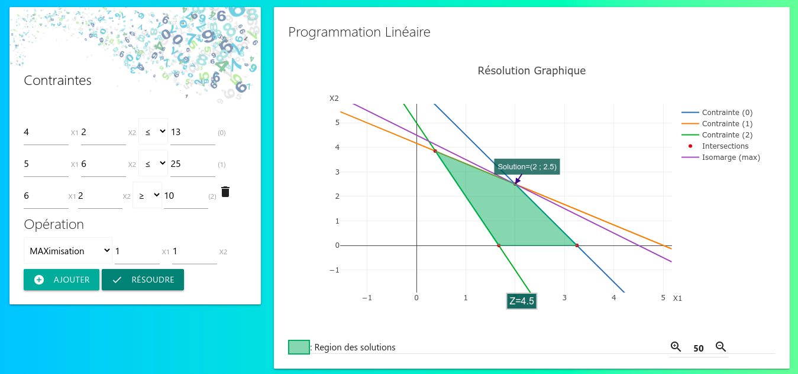

# Programmation Linéaire Graphique

## Description

Une application qui consiste à optimiser graphiquement (maximiser ou minimiser) une fonction linéaire de plusieurs variables qui sont reliées par des relations linéaires appelées contraintes. Cliquez [ici](https://www.iutbayonne.univ-pau.fr/~grau/2A/RO/cadre3.html#:~:text=On%20appelle%20Programmation%20Lin%C3%A9aire%2C%20le,des%20relations%20lin%C3%A9aires%20appel%C3%A9es%20contraintes.&text=Cette%20m%C3%A9thode%20n'est%20applicable,y%20a%20que%20deux%20variables.) pour plus d'explication.

- Supporte 2 variables
- Supporte 2 à n contraintes

Bibliothèques utilisées:

- [Math.js v10.1.0](https://mathjs.org)
- [Plotly.js v2.8.3](https://plotly.com/javascript)
- [Materialize v1.0.0](https://materializecss.com)

## Installation et usage

Aucune installation nécessaire, ouvrez tout simplement le fichier `index.html` depuis votre navigateur favori.

## Aperçu de l'interface graphique

  

